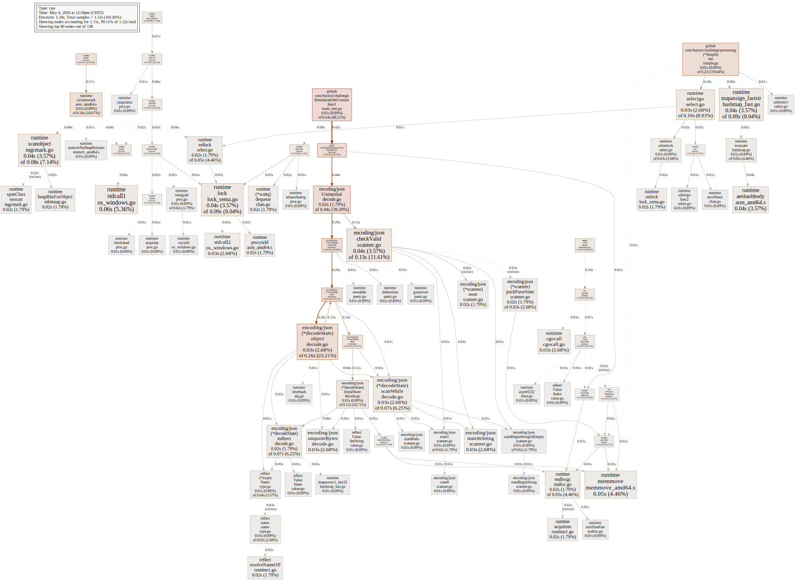

# Report

## Development plan

1) Create an initial full pipeline for the following components with simple/fake implementations:
    - input
    - output
    - counter
    - timestamp processing
2) Improve components one-by-one with unit tests
    1) Implement working but simple counter with sets
    2) Implement advanced timestamp processing
    3) Test/benchmark ingestion from Kafka (docker-compose)
    4) Output to Kafka
3) Benchmark, profile, improve performance
4) Try a probabilistic cardinality estimator - HyperLogLog++?   
5) Improve understanding of Kafka and document/implement more scalable solution

## Benchmark

### Setup

For benchmarking I used Golang's built-in benchmarking infrastructure and added code for generating
a CPU profile. I decided to only benchmark the input parsing, processing, counting, and output stage,
and in particular not include the possible overhead from Kafka.

### Results

Overall, we achieved an ingestion performance of 200k records/s, or 8MiB/s. This corresponds to about 10M records
per minute and does not seem to be I/O bound, i.e. I would expect Kafka being able to deliver higher data rates.

From the profiling data we see that the cpu usage can be basically partitioned into 4 domains:

* 9% for user counting
* 18% for garbage collection
* 27% for scheduling and communication
* 46% for JSON parsing and encoding

### Possible improvements

#### Counting
It does not seem like there is a lot of improvement possible here. The counting algorithm already
uses a hash-set, which has O(1) runtime complexity for insertion, and anyways, the processing and
counting use already less than 10% of the runtime.

What can and should be improved is memory complexity. While the hash set has O(1) runtime
complexity, it still requires O(n) space. This I expect to be a major bottleneck for scaling.

#### Garbage collection
The time spent in garbage collection can only be reduced indirectly by reducing the number of
dynamic allocations in the code. I expect both counting and JSON parsing to contribute to the
number of dynamic allocations. This could be verified with memory profiling.

#### Scheduling and communication
The CPU time for communication and scheduling could be reduced by using less Go routines and channels.
Maybe it could also help sending objects by reference instead than by value over a channel.

#### JSON parsing
Clearly, we are spending a lot of time in JSON parsing end encoding. Also, the JSON parsing
probably contributes mostly to the time required for garbage collection. It is very likely that
a more efficient JSON parser or a different data format could greatly improve runtime performance.

In Golang, the JSON serialization relies on reflection, which is implemented rather inefficiently
in Golang. Also here, a serialization, that utilizes static type information could improve
performance.

## Discussion

### Output format
Eventually we will have to produce statics per hour/day/week/month/year.
In order to solve this requirement we could have a copy of our software collecting continuously data continuously for a
longer period of time. In my view this would not be an optimal solution, as we would have to handle and recover from crashes
of machines.

Instead I will not only return a user count per minute, but also a raw aggregatable counter. This will not only allow
for aggregating the minutely counts to hourly, daily, etc, but also allow for setting up redundant instances of the
counting algorithm for the same partition. 

### JSON serialization
As discussed above, we are spending probably more than 50% of the whole runtime in JSON parsing and the related garbage
collection. It also poses an overhead in the data transfer and thus reduces the maximum throughput in terms of
records per second.

On the other hand JSON is a versatile, schema-less, and widely supported data format, which is usually a good choice
for log data.

I would make the choice of data format dependent on the possible current and future consumers of the data.
If there are multiple consumers that require a specific subset of the data fields, it could be
useful to add a pre-processing step in the data pipeline (e.g. a job consuming from one Kafka topic
and publishing to a second refined topic), which filters data and converts to more efficient format like
e.g. protobuf. The primary topic with JSON would remain to be used by future applications that
require the original data.

### Scalability
The biggest issue in terms of scalability, I expect to be memory usage. At least with the set
implementation for counting. If we still need to compute exact user counts, we can partition
the input data by uid, and deploy different consumers for the partitions. This would reduce the
memory and CPU usage per consumer, as each would only handle a subset of user ids. The final aggregation
to an overall count can be easily performed by summing all partitioned counts for a specific timestamp.

The output data (count and raw aggregatable value) can be partitioned by timestamp to allow
for efficient aggregation.

### Probabilistic cardinality estimation
 If the user is willing to trade memory usage for accuracy,
then a probabilistic cardinality estimation is a good choice.

I implemented a HyperLogLog++ based counter quickly for comparison with the set implementation.

According to the authors, the error at high sample numbers should be around 2%. The overall performance is unfortunately only
at 1/3 of the set implementation (70k records/s or 3 MiB/s) but the memory usage is minimal (1.5 kiB). To be investigated
further how to improve the runtime.

Another benefit of HLL, is that input data does not have to partitioned by uid. Also the raw aggregatable value is small
and can be easily aggregated.

### Error recovery
I decided to output not only the counts, but also the raw information of unique users. This
information can be used for checkpointing and can be aggregated to produce results for longer
time ranges.

### Late/Out-of-order frames
The "advanced" timestamp processing implementation always accepts data frames with timestamps
within a window of two minutes around the current system timestamp. By that we ignore all data
that is outside of this window, and an error is raised for each such out-of-order frame.
It would be useful to log such errors and include them as a metric in monitoring.
 